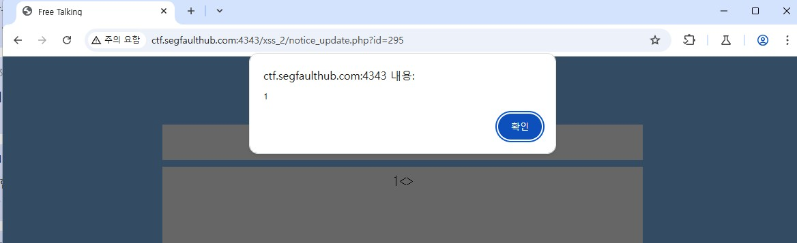

# XSS 2

## 취약점
- 타겟 Url : http://ctf.segfaulthub.com:4343/xss_2/notice_update.php
- 타겟 값 : 제목
- 입력 파라미터 : `test" onmouseover="alert(1)`
- 문제점 : XSS 공격
    - 제목 부분에 XSS 공격 발생

### 결과 화면

## 해결법
- html 이스케이프 처리
- 사용자가 입력한 값 검증 하여 저장