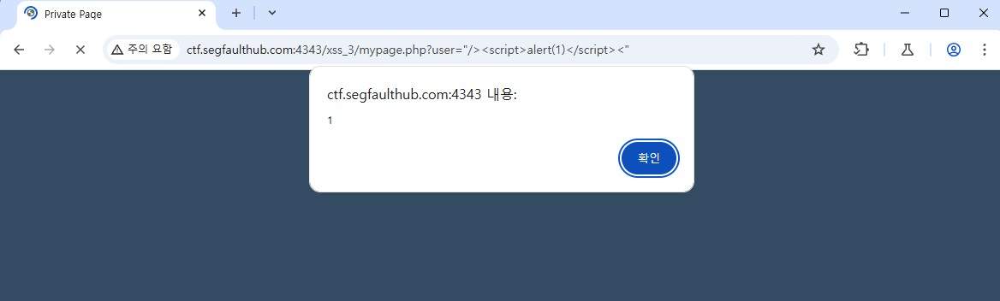
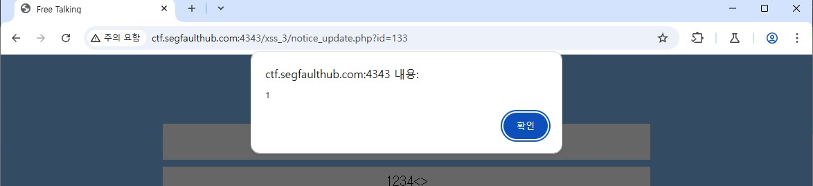

# XSS 3

## 취약점 1
- 타겟 Url : http://ctf.segfaulthub.com:4343/xss_3/mypage.php
- 타겟 값 : user
- 입력 파라미터 : `"/><"`
- 문제점 : XSS 공격
    - user의 값을 그대로 사용 하여 XSS 공격 발생

### 결과 화면

## 해결법
- user의 값을 session에 저장 하여 사용
- 사용자가 입력한 값 검증 하여 사용

## 취약점 2
- 타겟 Url : http://ctf.segfaulthub.com:4343/xss_3/notice_update.php
- 타겟 값 : 제목
- 입력 파라미터 : `test" onmouseover="alert(1)`
- 문제점 : XSS 공격
    - 제목의 값을 그대로 사용 하여 XSS 공격 발생

### 결과 화면

## 해결법
- html 이스케이프 처리
- 사용자가 입력한 값 검증 하여 저장

