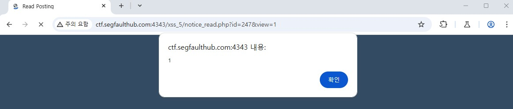

# XSS 4

## 취약점
- 타겟 Url : http://ctf.segfaulthub.com:4343/xss_5/notice_read.php
- 타겟 값 : 내용
- 입력 파라미터 : `<scrscriptipt>alalertert(1)</scscriptript>`
- 문제점 : XSS 공격
    - 내용의 값을 한번만 필터링 하여 XSS 발생

### 결과 화면

## 해결법
- 필터링을 script, alert을 적용하는 것이 아닌 `"`,`'` 을 적용 하는 방안 제시
- html 이스케이프 처리
- 사용자가 입력한 값 검증 하여 사용
